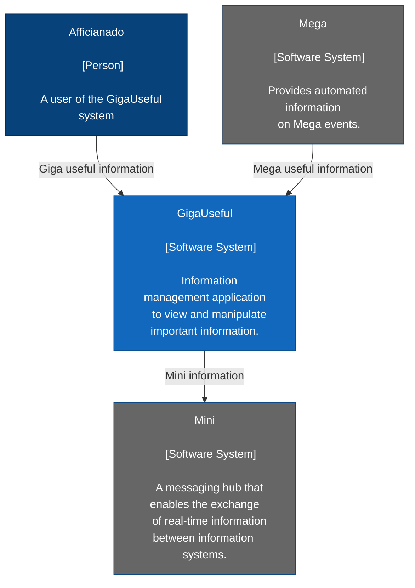

# Mermaid example

Mermaid example

## Context Diagram

```mermaid
flowchart TD
    User["Afficianado

    [Person]

    A user of the GigaUseful system   
    "]

    GigaUseful["GigaUseful

    [Software System]
    
    Information management application
    to view and manipulate important information.
    "]

    Mega["Mega
    
    [Software System]
    
    Provides automated information
    on Mega events.            
    "]


    LINX["Mini

    [Software System]

    A messaging hub that enables the exchange
    of real-time information between information systems.    
    "]

    User--"Giga useful information"-->GigaUseful    
    Mega--"Mega useful information"-->GigaUseful
    GigaUseful--"Mini information"-->LINX

classDef focusSystem fill:#1168bd,stroke:#0b4884,color:#ffffff
classDef supportingSystem fill:#666,stroke:#0b4884,color:#ffffff
classDef person fill:#08427b,stroke:#052e56,color:#ffffff

class User person
class GigaUseful focusSystem
class Mega supportingSystem
class LINX supportingSystem

```
